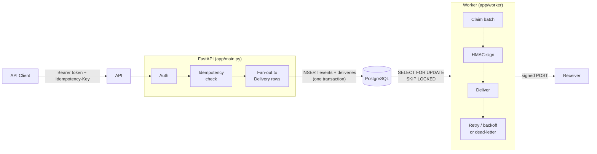

# Reliable Webhook Delivery Platform

At-least-once webhook delivery with exponential backoff + jitter, idempotency,
dead-lettering, manual redrive, and HMAC-SHA256 signing — Postgres-as-queue,
no external broker.

> **Status: MVP complete, plus hardening.** API, worker, retries,
> dead-lettering, redrive, SSRF protection, rate limiting, metrics, and an
> observability dashboard are all live. See [`docs/ROADMAP.md`](docs/ROADMAP.md).

## What is this?

Apps need to tell other apps when something happens — "a customer paid," "an
order shipped." Sending that notification once and hoping it arrives isn't
enough: receivers go down, time out, or get overloaded. This service sits in
between and makes delivery reliable:

- Failed deliveries are **retried automatically** with exponential backoff.
- Deliveries that exhaust retries land in a **dead-letter queue** for
  inspection and one-click **redrive**.
- Every delivery is **HMAC-signed and timestamped** so receivers can verify
  authenticity and reject replays.
- A live **dashboard** shows delivery health in real time.

## Live demo

Hosted on [Fly.io](https://fly.io) with Postgres on [Neon](https://neon.tech):

- **Dashboard:** https://hookit.fly.dev/dashboard/ — watch a real producer
  service publish live crypto-price events, get delivered (HMAC-signed) into
  a real Discord channel. Buttons let you take the receiver down and watch
  retries → backoff → dead-letter → redrive happen on live traffic.
- **API docs:** https://hookit.fly.dev/docs — try any endpoint directly.
- **Health check:** https://hookit.fly.dev/health

This is an API, not a website — `/` returns `404` by design; start at
`/dashboard/` or `/docs`. The instance scales to zero when idle, so the first
request after a quiet period may take a second or two.

Full walkthrough (mint a key, register an endpoint, publish an event) and how
the dashboard/producer/Discord demo is wired: [`docs/DEPLOY.md`](docs/DEPLOY.md)
and [`docs/ARCHITECTURE.md`](docs/ARCHITECTURE.md).

## Architecture

Two processes share one PostgreSQL database. Ingestion and delivery are
decoupled so a slow receiver never blocks event publishing.



Full design, sequence diagram, and the delivery lifecycle:
[`docs/ARCHITECTURE.md`](docs/ARCHITECTURE.md).

## Key design decisions

- **Postgres as the queue**, not a broker (Redis/SQS/Kafka). Event + delivery
  rows + idempotency record land in one transaction, so nothing can be stored
  without being enqueued. `SELECT … FOR UPDATE SKIP LOCKED` lets multiple
  workers claim disjoint batches safely.
- **At-least-once, not exactly-once.** HTTP acks can be lost even after a
  successful POST, so this service retries and lets receivers dedupe on
  stable event IDs instead of chasing an impractical guarantee.
- **Exponential backoff with jitter** (`min(base × 2^attempt, cap) + jitter`)
  spreads retries so a mass outage doesn't resynchronize into a new spike.
- **SSRF-aware endpoint registration** rejects loopback/private/link-local
  target IPs at registration time (`app/services/ssrf.py`).

Rationale and tradeoffs for each: [`docs/ARCHITECTURE.md`](docs/ARCHITECTURE.md).

## Run locally

Requires Python 3.12 and Docker.

```bash
python -m venv .venv && source .venv/bin/activate
pip install -e ".[dev]"

cp .env.example .env
docker compose up -d postgres
alembic upgrade head

uvicorn app.main:app --reload          # API  → http://localhost:8000/health
python -m app.worker                   # delivery worker, separate terminal
```

## API quick-start

```http
POST /events
Authorization: Bearer <api_key>
Idempotency-Key: <unique-key>
Content-Type: application/json

{ "type": "user.created", "payload": { "user_id": "abc123" } }
```

Response: `{ "event_id": "evt_...", "queued_deliveries": 2 }`. The worker
delivers asynchronously, retries on failure, and dead-letters after exhausting
attempts — redrive with `POST /deliveries/{id}/redrive`. Full endpoint list at
`/docs`.

## Quality bar

```bash
ruff format --check .   # formatting
ruff check .             # lint
mypy app tests           # strict static types
pytest                   # real-Postgres tests, no mocking
```

All four run in CI on every PR (`.github/workflows/ci.yml`) and must pass to
merge. Reproducible reliability scenarios (backoff → dead-letter, redrive,
idempotency, crash recovery) live in [`demo/`](demo); a throughput/latency
harness lives in [`benchmark/`](benchmark).

## Autonomous agent loop

Development is driven by a self-advancing GitHub Actions pipeline: a Planner
agent maintains a backlog, a Builder implements one issue per PR, a Reviewer
approves or requests changes, and CI-green + approved PRs auto-merge — no
human merge required day to day. Rules live in [`CLAUDE.md`](CLAUDE.md) and
[`agents/`](agents/); full lifecycle in
[`docs/AGENT_WORKFLOW.md`](docs/AGENT_WORKFLOW.md).

## License

MIT.
