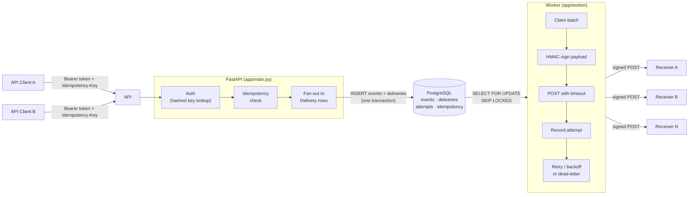
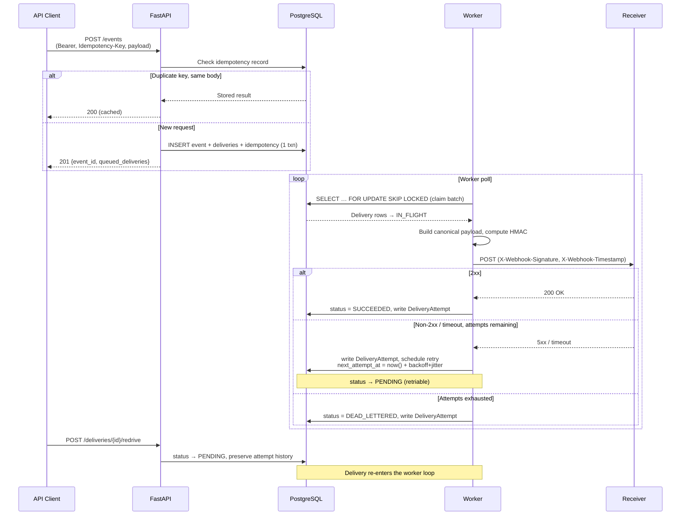

# Reliable Webhook Delivery Platform

**At-least-once delivery, exponential backoff with jitter, idempotency, dead-letter
queuing, manual redrive, HMAC-SHA256 signing, and Postgres-as-queue — no external
broker required.**

> **Status: MVP complete, plus hardening.** The API, delivery worker, retries,
> dead-lettering, inspection endpoints, manual redrive, and end-to-end tests are
> all live — along with SSRF protection, per-endpoint rate limiting, Prometheus
> metrics, a `LISTEN/NOTIFY`-driven worker, an observability dashboard with a
> one-click live simulation, and a Discord payload transform. See
> [`docs/ROADMAP.md`](docs/ROADMAP.md).

---

## What is this?

Modern apps constantly need to tell *other* apps when something happens — "a
customer paid," "an order shipped," "a user signed up." That notification is
called a **webhook**: one app sends a small message to a web address the other
app gave it.

The hard part isn't sending the message — it's sending it **reliably**. The
receiving computer might be restarted, offline, or just slow to respond for a
few minutes. If you only try once, that notification is lost forever, silently.

This project is a delivery system that sits in between and guarantees the
message gets there:

- If the receiver doesn't respond, it **automatically tries again**, waiting a
  little longer each time (like a delivery van circling back instead of giving
  up after one knock).
- If it still fails after several attempts, it **doesn't throw the message
  away** — it sets it aside (a "dead letter") so a human can look at it and
  resend it later with one click.
- Every attempt is signed and time-stamped, so the receiver can trust the
  message really came from here and hasn't been tampered with or replayed.
- A live **dashboard** shows all of this happening in real time — how many
  messages succeeded, how many are stuck, and how long delivery is taking —
  the way a package tracking page shows a shipment's journey.

In short: it's the plumbing that makes sure "Message sent" also means
"message received" — even when the internet has a bad day.

---

## Live demo

A live instance runs on [Fly.io](https://fly.io) (API + delivery worker), backed by
serverless Postgres on [Neon](https://neon.tech):

- **Interactive API docs:** https://hookit.fly.dev/docs — the Swagger UI lists and
  lets you try every endpoint.
- **Observability dashboard:** https://hookit.fly.dev/dashboard/ — a read-only
  console showing delivery health for a project (paste in a project API key).
- **Health check:** https://hookit.fly.dev/health → `{"status":"ok"}`

It's an **API, not a website**, so the root path (`/`) intentionally returns
`404 Not Found` — start at `/docs`. Most endpoints require an
`Authorization: Bearer <api-key>` header. See
[`docs/DEPLOY.md`](docs/DEPLOY.md) for an end-to-end walkthrough (mint a key,
register an endpoint, publish an event, watch the signed delivery arrive) and for
how the deployment is wired.

> The instance scales to zero when idle to keep hosting costs near zero, so the
> first request after a quiet period may take ~1–2s to wake.

---

## Try it yourself — no coding required

**The fast path: two buttons, under 30 seconds, nothing to install.**

1. **Open https://hookit.fly.dev/dashboard/**
2. Click **"New demo project"** — mints a fresh project + API key and
   connects; no Swagger detour.
3. Click **"Simulate load"** — publishes a batch of real events through the
   real pipeline. Watch the cards fill in live: most deliveries succeed
   within a second, a couple genuinely retry with real exponential backoff
   (~10s), and one is driven to dead-letter so you can click its **redrive**
   link yourself and watch it recover.

That's the whole reliability story — retry, backoff, dead-letter, redrive —
happening in front of you. (This is unrelated to the [`demo/`](demo) CLI
scripts elsewhere in this repo, which drive a real external receiver process
from your terminal for local reliability testing — see below.)

### The manual path — and how to pipe events into Discord

Prefer to drive it yourself through the API? The interactive docs page has a
"Try it out" button on every endpoint. A fun way to see it work: pipe events
into a Discord channel and watch them arrive as chat messages.

1. **Open https://hookit.fly.dev/docs**
2. **Create a project** — expand `POST /projects`, click *Try it out*, give it
   any name, click *Execute*. Copy the `id` from the response.
3. **Mint an API key** — expand `POST /projects/{project_id}/api-keys`, paste
   the project id, *Execute*. Copy the `key` — it's shown once, this is your
   password for the next steps.
4. **Register an endpoint** — expand `POST /endpoints`. Click the padlock icon
   once and paste `Bearer <your key>` to authorize the whole page. Then use a
   [Discord webhook URL](https://support.discord.com/hc/en-us/articles/228383668)
   from a channel you own as `url`, set `payload_format` to `"discord"`, and
   `event_types` to `["demo.ping"]`. *Execute*.
5. **Publish an event** — expand `POST /events`, set a body like
   `{"type": "demo.ping", "payload": {"hello": "world"}}`, *Execute*.
6. Watch the message show up in your Discord channel within a couple of
   seconds — and watch the delivery succeed on the
   [dashboard](https://hookit.fly.dev/dashboard/) (paste in the same API key).

No terminal, no code — just filling in forms on a web page.

---

## Observability dashboard

A console at `/dashboard/` visualizes delivery health for a project: status
totals, terminal success rate, p50/p95/p99 latency, dead-letter depth,
one-minute throughput, and expandable per-delivery retry timelines with inline
redrive. It's a static single-page app that authenticates against the JSON API
with a project API key — the same key used for `/events` and `/endpoints` — so
no data is exposed unauthenticated.

It's backed by `GET /metrics/summary`, which aggregates the `deliveries` and
`delivery_attempts` tables directly (via `percentile_cont` for latency), so the
numbers are durable and survive worker restarts — unlike the process-local
Prometheus counters exposed at `/metrics`.

Two buttons on the dashboard turn it from a passive viewer into a live demo:
**"New demo project"** self-provisions a project + API key (`POST /projects` +
`POST /projects/{id}/api-keys`, both intentionally unauthenticated bootstrap
endpoints), and **"Simulate load"** (`POST /simulate/run`) publishes a fixed
batch of real events through the real pipeline — most succeed immediately, a
couple retry once with genuine exponential backoff, and one is driven to
dead-lettered so it can be redriven right there. The batch is delivered to a
reserved, self-referential receiver endpoint (`POST /simulate/receiver/{id}`,
HMAC-verified like any real receiver) rather than a third-party URL, so the
demo has no external dependency. See `app/services/simulate.py` for exactly
which parts are real production code paths versus an intentional, documented
fast-forward of retry *timing* (not of signing, delivery, or dead-lettering
logic) — detailed in [`docs/ARCHITECTURE.md`](docs/ARCHITECTURE.md).

---

## Architecture

Two processes share one PostgreSQL database. Ingestion and delivery are decoupled
so a slow receiver never blocks event publishing.



### Delivery lifecycle



Full design: [`docs/ARCHITECTURE.md`](docs/ARCHITECTURE.md).

---

## Design decisions & tradeoffs

### Postgres-as-queue vs. a broker

PostgreSQL handles both persistence *and* the delivery job queue. Fan-out (event
+ deliveries + idempotency record) lands in **one atomic transaction**, so there
is no window between "event stored" and "delivery enqueued." `SELECT … FOR UPDATE
SKIP LOCKED` lets multiple workers claim non-overlapping batches safely without
extra coordination. A dedicated broker (Redis, SQS, Kafka) is a deliberate
*later* decision, made only once Postgres throughput is measured and found
insufficient.

### `FOR UPDATE SKIP LOCKED`

The claim query locks exactly the rows it takes and skips any locked by a
concurrent worker — no deadlocks, no thundering-herd on the queue table. Each
worker processes its batch independently; horizontal scaling is a matter of
running more worker processes.

### Exponential backoff with jitter

Retry delay follows `min(base × 2^(attempt−1), cap) + random_jitter`. The jitter
(full or equal) spreads retries over time so a mass failure at one receiver does
not synchronise retries into a new spike. Defaults (`base=10s`, `cap=1h`,
`max_attempts=6`) are config-driven and tunable without a code change.

### At-least-once vs. exactly-once

Exactly-once delivery over HTTP is impractical: acknowledgements can be lost even
after a successful POST. This service chooses at-least-once + HMAC signing +
stable event IDs so that receivers can deduplicate on their side when they need
to. Workers re-deliver after a crash; claim leases (`leased_until`) ensure stuck
deliveries become eligible again rather than being silently dropped.

### Pluggable per-endpoint payload format

Each endpoint has a `payload_format`: `raw` (the native
`{event_id, type, payload}` envelope, the default) or `discord`, which maps the
event onto a Discord webhook message embed so deliveries render as chat
messages in a Discord channel. The transform lives in a pure, unit-tested
function (`app/services/transform.py`) applied by the worker *before* signing,
so the HMAC signature always covers the exact bytes sent to the receiver.

### SSRF handling of untrusted target URLs

Webhook target URLs are supplied by authenticated clients but treated as
untrusted. Registration rejects IP-literal hosts in loopback, RFC 1918 private,
and link-local/metadata ranges (`app/services/ssrf.py`). DNS-based SSRF
(a hostname that *resolves* to a private address) is a known, documented
limitation — out of scope until egress-time resolution checks are added.

### Fast-forwarding the live simulation's dead-letter, honestly

`POST /simulate/run` (`app/services/simulate.py`) publishes real events
through the real fan-out and delivery path — the same `ingest_event()` and
`process_delivery()` production code the rest of the system uses, no test
doubles. The one deliberate shortcut: the batch's "always fails" delivery is
driven through its attempts back-to-back instead of waiting for real
exponential backoff between them (with default settings, 6 attempts would
otherwise take ~5 real minutes to exhaust), so a dashboard visitor gets a
redrivable dead-lettered row in under a second. Signing, HTTP delivery,
attempt recording, and the dead-letter threshold itself are all unmodified —
only the *wait* between attempts is skipped, and that skip is isolated to one
function (`_fast_forward_to_dead_letter`) with a docstring saying so, not
hidden inside the general delivery path.

---

## Reliability demo scenarios

Four reproducible scripts in [`demo/`](demo) exercise the reliability guarantees
end-to-end against a local stack — no mocking, real Postgres, real HTTP:

1. **Failure → backoff → dead-letter** — an always-failing receiver drives a
   delivery through the full retry cycle to `DEAD_LETTERED`.
2. **Redrive** — a dead-lettered delivery is redriven and succeeds, preserving
   prior attempt history.
3. **Idempotency** — replaying `POST /events` with the same key is a no-op;
   a payload mismatch on a known key returns `409`.
4. **Crash recovery** — the worker is killed mid-delivery; the transaction
   rolls back and a restarted worker completes the delivery exactly once.

```bash
bash demo/run_all.sh   # runs all four against a local API + Postgres
```

See [`demo/README.md`](demo/README.md) for prerequisites and individual runs.

---

## Benchmark numbers

A throughput + latency harness lives in [`benchmark/`](benchmark) — it publishes
N events at a configurable concurrency and measures end-to-end delivery latency
(p50/p95/p99) against a running API + worker:

```bash
python -m benchmark --events 500 --concurrency 10
```

Representative run — 500 events, concurrency 10, single worker, GitHub Actions
`ubuntu-latest` runner (shared CPU; expect higher ingest throughput on a
dedicated dev machine):

| metric | value |
|---|---|
| ingest throughput | 40.4 events/sec |
| delivery throughput | 208.7 deliveries/sec |
| wall time (worker start → all delivered) | 2.40 s |
| latency p50 | 7,500 ms |
| latency p95 | 12,315 ms |
| latency p99 | 12,761 ms |
| latency mean | 7,512 ms |
| latency min | 2,281 ms |
| latency max | 12,785 ms |

> **Context**: end-to-end latency spans `created_at` → `updated_at`, which
> includes queue-wait time — all 500 events were ingested before the worker
> started, so the first events waited ~12 s in the queue before delivery began.
> These figures are from a single representative run on a resource-constrained
> CI box; they are not a production SLA. The architecture supports horizontal
> scaling by running multiple worker processes.

---

## Quality bar

All four checks run identically in CI (`.github/workflows/ci.yml`) and must pass
on every PR:

```bash
ruff format --check .   # formatting
ruff check .            # lint
mypy app tests          # strict static types
pytest                  # real-Postgres transactional tests (no mocks)
```

`mypy` runs in strict mode; the test suite hits a live PostgreSQL instance spun
up by the CI service — no database mocking. A PR that breaks any of these four
checks cannot merge.

---

## Autonomous agent loop

Development is driven by a self-advancing GitHub Actions pipeline built on
[`anthropics/claude-code-action`](https://github.com/anthropics/claude-code-action):
a **Planner** agent keeps a backlog of small, well-specified `agent:ready` issues;
a **Builder** picks the oldest issue, implements the smallest complete solution,
and opens a PR; a **Reviewer** approves or requests changes; and an **auto-merge**
workflow squash-merges any PR that is CI-green and Reviewer-approved, which
re-triggers the Builder for the next issue — no human merge required. Full
details: [`docs/AGENT_WORKFLOW.md`](docs/AGENT_WORKFLOW.md). Agent rules live in
[`CLAUDE.md`](CLAUDE.md) and [`agents/`](agents/).

---

## Run locally

Requires Python 3.12 and Docker.

```bash
# Clone, then create a virtual environment
python -m venv .venv && source .venv/bin/activate
pip install -e ".[dev]"

# Configure
cp .env.example .env

# Start Postgres
docker compose up -d postgres

# Run database migrations
alembic upgrade head

# Run the API
uvicorn app.main:app --reload
# → http://localhost:8000/health  →  {"status": "ok"}

# In a separate terminal, run the delivery worker
python -m app.worker
```

## Run tests & quality checks

```bash
ruff format --check .
ruff check .
mypy app tests
pytest
```

## API quick-start

```http
POST /events
Authorization: Bearer <api_key>
Idempotency-Key: <unique-key>
Content-Type: application/json

{ "type": "user.created", "payload": { "user_id": "abc123", "email": "test@example.com" } }
```

Response:

```json
{ "event_id": "evt_...", "queued_deliveries": 2 }
```

The system authenticates the key, enforces idempotency, stores the event, fans
out to subscribed endpoints, and returns. The worker delivers asynchronously,
records every attempt, and retries failures on the backoff schedule. Dead-lettered
deliveries can be redriven via `POST /deliveries/{id}/redrive`.

Operational extras beyond the core delivery path: `GET /metrics` (Prometheus
exposition) and `GET /metrics/summary` (dashboard-facing aggregates),
per-endpoint `rate_limit_rps` to throttle a slow receiver, per-endpoint
`payload_format` (`raw` or `discord`) to transform outbound deliveries,
`POST /endpoints/{id}/rotate-secret` for signing-secret rotation without
downtime, and `POST /simulate/run` (project-scoped) which powers the
dashboard's one-click live demo. Full endpoint list: `/docs`.

---

## Human owner responsibilities

The human owner ([@jinhobh](https://github.com/jinhobh)) only needs to:

1. Keep `CLAUDE_CODE_OAUTH_TOKEN` (Claude Pro/Max) or `ANTHROPIC_API_KEY`
   configured in the repo secrets.
2. Keep `AGENT_GH_TOKEN` (PAT) valid so agent actions re-trigger the next
   workflow.
3. Intervene when an agent is stuck or to steer the roadmap.

To restore a human merge gate, delete `.github/workflows/auto-merge.yml`.

---

## License

MIT.
