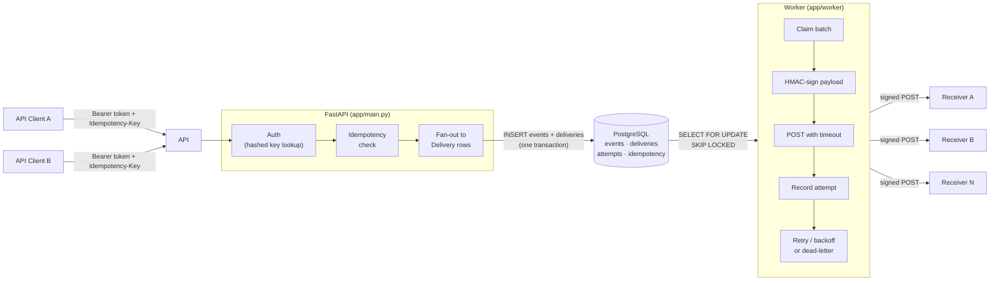
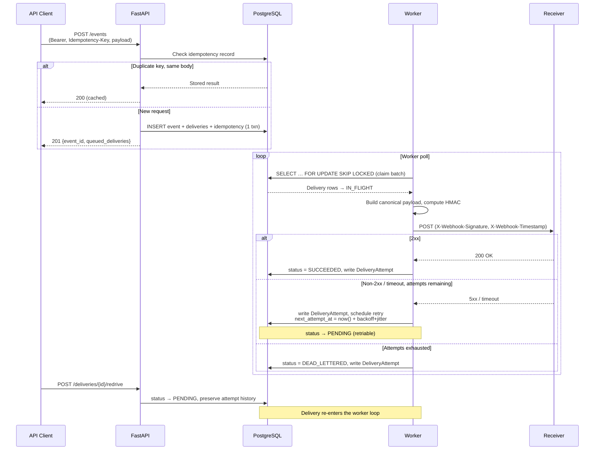

# Reliable Webhook Delivery Platform

**At-least-once delivery, exponential backoff with jitter, idempotency, dead-letter
queuing, manual redrive, HMAC-SHA256 signing, and Postgres-as-queue — no external
broker required.**

> **Status: MVP complete, plus hardening.** The API, delivery worker, retries,
> dead-lettering, inspection endpoints, manual redrive, and end-to-end tests are
> all live — along with SSRF protection, per-endpoint rate limiting, Prometheus
> metrics, and a `LISTEN/NOTIFY`-driven worker. See [`docs/ROADMAP.md`](docs/ROADMAP.md).

---

## Live demo

A live instance runs on [Fly.io](https://fly.io) (API + delivery worker), backed by
serverless Postgres on [Neon](https://neon.tech):

- **Interactive API docs:** https://hookit.fly.dev/docs — the Swagger UI lists and
  lets you try every endpoint.
- **Health check:** https://hookit.fly.dev/health → `{"status":"ok"}`

It's an **API, not a website**, so the root path (`/`) intentionally returns
`404 Not Found` — start at `/docs`. Most endpoints require an
`Authorization: Bearer <api-key>` header. See
[`docs/DEPLOY.md`](docs/DEPLOY.md) for an end-to-end walkthrough (mint a key,
register an endpoint, publish an event, watch the signed delivery arrive) and for
how the deployment is wired.

> The instance scales to zero when idle to keep hosting costs near zero, so the
> first request after a quiet period may take ~1–2s to wake.

---

## Architecture

Two processes share one PostgreSQL database. Ingestion and delivery are decoupled
so a slow receiver never blocks event publishing.



### Delivery lifecycle



Full design: [`docs/ARCHITECTURE.md`](docs/ARCHITECTURE.md).

---

## Design decisions & tradeoffs

### Postgres-as-queue vs. a broker

PostgreSQL handles both persistence *and* the delivery job queue. Fan-out (event
+ deliveries + idempotency record) lands in **one atomic transaction**, so there
is no window between "event stored" and "delivery enqueued." `SELECT … FOR UPDATE
SKIP LOCKED` lets multiple workers claim non-overlapping batches safely without
extra coordination. A dedicated broker (Redis, SQS, Kafka) is a deliberate
*later* decision, made only once Postgres throughput is measured and found
insufficient.

### `FOR UPDATE SKIP LOCKED`

The claim query locks exactly the rows it takes and skips any locked by a
concurrent worker — no deadlocks, no thundering-herd on the queue table. Each
worker processes its batch independently; horizontal scaling is a matter of
running more worker processes.

### Exponential backoff with jitter

Retry delay follows `min(base × 2^(attempt−1), cap) + random_jitter`. The jitter
(full or equal) spreads retries over time so a mass failure at one receiver does
not synchronise retries into a new spike. Defaults (`base=10s`, `cap=1h`,
`max_attempts=6`) are config-driven and tunable without a code change.

### At-least-once vs. exactly-once

Exactly-once delivery over HTTP is impractical: acknowledgements can be lost even
after a successful POST. This service chooses at-least-once + HMAC signing +
stable event IDs so that receivers can deduplicate on their side when they need
to. Workers re-deliver after a crash; claim leases (`leased_until`) ensure stuck
deliveries become eligible again rather than being silently dropped.

### SSRF handling of untrusted target URLs

Webhook target URLs are supplied by authenticated clients but treated as
untrusted. Registration rejects IP-literal hosts in loopback, RFC 1918 private,
and link-local/metadata ranges (`app/services/ssrf.py`). DNS-based SSRF
(a hostname that *resolves* to a private address) is a known, documented
limitation — out of scope until egress-time resolution checks are added.

---

## Reliability demo scenarios

Four reproducible scripts in [`demo/`](demo) exercise the reliability guarantees
end-to-end against a local stack — no mocking, real Postgres, real HTTP:

1. **Failure → backoff → dead-letter** — an always-failing receiver drives a
   delivery through the full retry cycle to `DEAD_LETTERED`.
2. **Redrive** — a dead-lettered delivery is redriven and succeeds, preserving
   prior attempt history.
3. **Idempotency** — replaying `POST /events` with the same key is a no-op;
   a payload mismatch on a known key returns `409`.
4. **Crash recovery** — the worker is killed mid-delivery; the transaction
   rolls back and a restarted worker completes the delivery exactly once.

```bash
bash demo/run_all.sh   # runs all four against a local API + Postgres
```

See [`demo/README.md`](demo/README.md) for prerequisites and individual runs.

---

## Benchmark numbers

A throughput + latency harness lives in [`benchmark/`](benchmark) — it publishes
N events at a configurable concurrency and measures end-to-end delivery latency
(p50/p95/p99) against a running API + worker:

```bash
python -m benchmark --events 500 --concurrency 10
```

Representative run — 500 events, concurrency 10, single worker, GitHub Actions
`ubuntu-latest` runner (shared CPU; expect higher ingest throughput on a
dedicated dev machine):

| metric | value |
|---|---|
| ingest throughput | 40.4 events/sec |
| delivery throughput | 208.7 deliveries/sec |
| wall time (worker start → all delivered) | 2.40 s |
| latency p50 | 7,500 ms |
| latency p95 | 12,315 ms |
| latency p99 | 12,761 ms |
| latency mean | 7,512 ms |
| latency min | 2,281 ms |
| latency max | 12,785 ms |

> **Context**: end-to-end latency spans `created_at` → `updated_at`, which
> includes queue-wait time — all 500 events were ingested before the worker
> started, so the first events waited ~12 s in the queue before delivery began.
> These figures are from a single representative run on a resource-constrained
> CI box; they are not a production SLA. The architecture supports horizontal
> scaling by running multiple worker processes.

---

## Quality bar

All four checks run identically in CI (`.github/workflows/ci.yml`) and must pass
on every PR:

```bash
ruff format --check .   # formatting
ruff check .            # lint
mypy app tests          # strict static types
pytest                  # real-Postgres transactional tests (no mocks)
```

`mypy` runs in strict mode; the test suite hits a live PostgreSQL instance spun
up by the CI service — no database mocking. A PR that breaks any of these four
checks cannot merge.

---

## Autonomous agent loop

Development is driven by a self-advancing GitHub Actions pipeline built on
[`anthropics/claude-code-action`](https://github.com/anthropics/claude-code-action):
a **Planner** agent keeps a backlog of small, well-specified `agent:ready` issues;
a **Builder** picks the oldest issue, implements the smallest complete solution,
and opens a PR; a **Reviewer** approves or requests changes; and an **auto-merge**
workflow squash-merges any PR that is CI-green and Reviewer-approved, which
re-triggers the Builder for the next issue — no human merge required. Full
details: [`docs/AGENT_WORKFLOW.md`](docs/AGENT_WORKFLOW.md). Agent rules live in
[`CLAUDE.md`](CLAUDE.md) and [`agents/`](agents/).

---

## Run locally

Requires Python 3.12 and Docker.

```bash
# Clone, then create a virtual environment
python -m venv .venv && source .venv/bin/activate
pip install -e ".[dev]"

# Configure
cp .env.example .env

# Start Postgres
docker compose up -d postgres

# Run database migrations
alembic upgrade head

# Run the API
uvicorn app.main:app --reload
# → http://localhost:8000/health  →  {"status": "ok"}

# In a separate terminal, run the delivery worker
python -m app.worker
```

## Run tests & quality checks

```bash
ruff format --check .
ruff check .
mypy app tests
pytest
```

## API quick-start

```http
POST /events
Authorization: Bearer <api_key>
Idempotency-Key: <unique-key>
Content-Type: application/json

{ "type": "user.created", "payload": { "user_id": "abc123", "email": "test@example.com" } }
```

Response:

```json
{ "event_id": "evt_...", "queued_deliveries": 2 }
```

The system authenticates the key, enforces idempotency, stores the event, fans
out to subscribed endpoints, and returns. The worker delivers asynchronously,
records every attempt, and retries failures on the backoff schedule. Dead-lettered
deliveries can be redriven via `POST /deliveries/{id}/redrive`.

Operational extras beyond the core delivery path: `GET /metrics` (Prometheus
exposition), per-endpoint `rate_limit_rps` to throttle a slow receiver, and
`POST /endpoints/{id}/rotate-secret` for signing-secret rotation without
downtime. Full endpoint list: `/docs`.

---

## Human owner responsibilities

The human owner ([@jinhobh](https://github.com/jinhobh)) only needs to:

1. Keep `CLAUDE_CODE_OAUTH_TOKEN` (Claude Pro/Max) or `ANTHROPIC_API_KEY`
   configured in the repo secrets.
2. Keep `AGENT_GH_TOKEN` (PAT) valid so agent actions re-trigger the next
   workflow.
3. Intervene when an agent is stuck or to steer the roadmap.

To restore a human merge gate, delete `.github/workflows/auto-merge.yml`.

---

## License

MIT.
